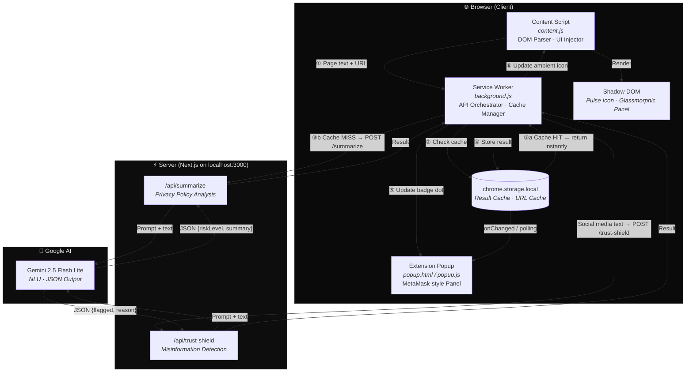
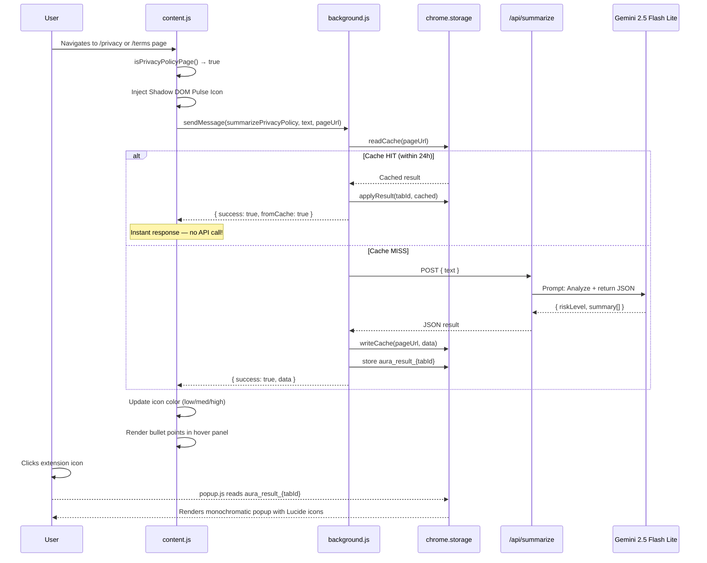
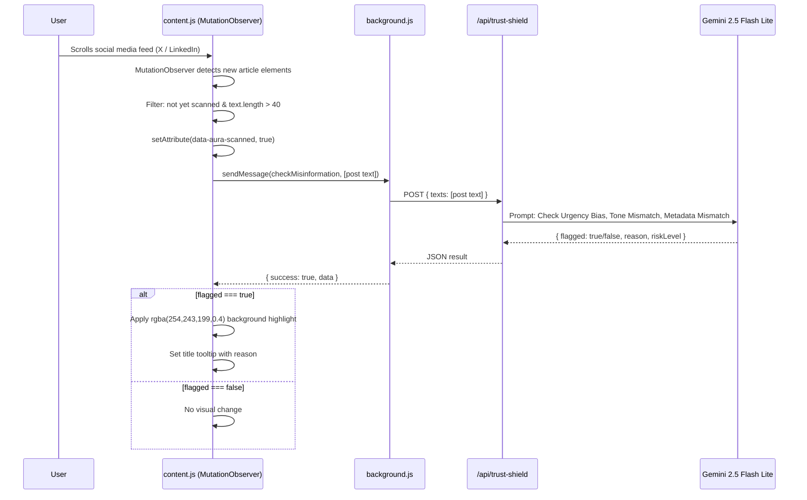

<div align="center">

# ◈ Aura
### Ambient Security & Privacy Layer

*A calm, non-intrusive browser extension that quietly protects you — without the noise.*

[](https://developer.chrome.com/docs/extensions/mv3/)
[](https://nextjs.org/)
[](https://ai.google.dev/)
[](.)

</div>

---

## Overview

Aura is an ambient security layer built as a Chrome Extension. It silently monitors your browsing environment and provides subtle, non-intrusive visual cues to educate and protect users — without interrupting their flow.

| Feature | Description |
|---|---|
| **Privacy Sense** | Detects privacy/terms pages and generates a 3-bullet plain-English summary |
| **Trust Shield** | Scans social media feeds for Urgency Bias, Tone Mismatch & Metadata inconsistencies |
| **Ambient UI** | Pulsing icon + glassmorphic hover panel injected via Shadow DOM |
| **Smart Cache** | 24-hour URL-based cache to avoid redundant API calls |
| **Popup Panel** | MetaMask-style extension popup with skeleton loading & live updates |

---

## Architecture Diagram



---

## Flow Diagram — Privacy Sense



---

## Flow Diagram — Trust Shield



---

## Project Structure

```
AURA/
├── extension/                  # Chrome Extension (Manifest V3)
│   ├── manifest.json           # Extension config, permissions, popup
│   ├── background.js           # Service Worker: cache + API orchestration
│   ├── content.js              # DOM parser, Shadow DOM injector, Trust Shield observer
│   ├── popup.html              # MetaMask-style popup UI
│   ├── popup.js                # Popup logic with live storage listener + polling
│   ├── styles.css              # Global highlight class for Trust Shield
│   └── icons/                  # Extension icons (16, 48, 128px)
│
└── api/                        # Next.js Backend (App Router)
    ├── src/app/api/
    │   ├── summarize/route.ts  # Privacy policy analysis endpoint
    │   └── trust-shield/route.ts # Misinformation detection endpoint
    ├── next.config.ts          # CORS headers for extension access
    └── .env                    # GEMINI_API_KEY (never committed)
```

---

## Setup

### Prerequisites
- Node.js 18+
- Google Chrome
- Gemini API Key from [Google AI Studio](https://aistudio.google.com/)

### 1. Start the Backend

```bash
cd api
# Add your key to .env
echo "GEMINI_API_KEY=your_key_here" > .env
npm install
npm run dev
# Backend running at http://localhost:3000
```

### 2. Load the Extension

1. Open `chrome://extensions` in Chrome
2. Enable **Developer Mode** (top right toggle)
3. Click **Load unpacked**
4. Select the `/extension` folder

### 3. Test it

- Navigate to `https://policies.google.com/privacy` → Pulse icon appears, click the extension icon for the full summary
- Navigate to `https://x.com` or `https://linkedin.com` → suspicious posts get a subtle yellow highlight

---

## Tech Stack

| Layer | Technology |
|---|---|
| Browser Extension | Chrome Manifest V3, Vanilla JS, Shadow DOM |
| Backend | Next.js 16 App Router, TypeScript |
| AI | Google Gemini 2.5 Flash Lite |
| Cache | `chrome.storage.local` (URL-keyed, 24h TTL) |
| UI | Monochromatic design, Lucide SVG icons, CSS shimmer skeleton |

---

<div align="center">
<sub>Built for InnovateX 1.0 — Problem Statement #14: Cybersecurity & Privacy</sub>
</div>
