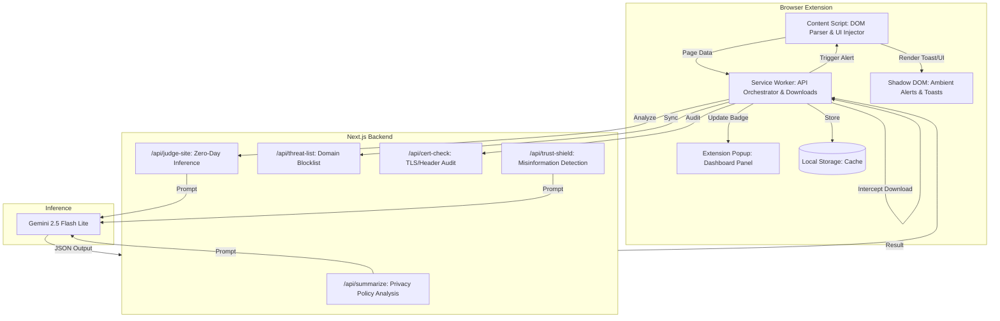
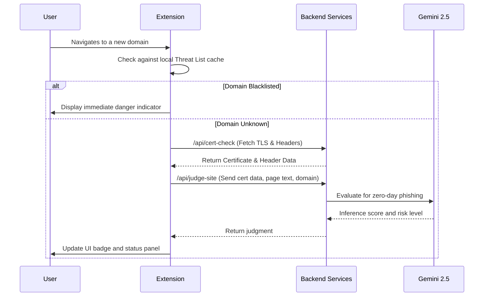
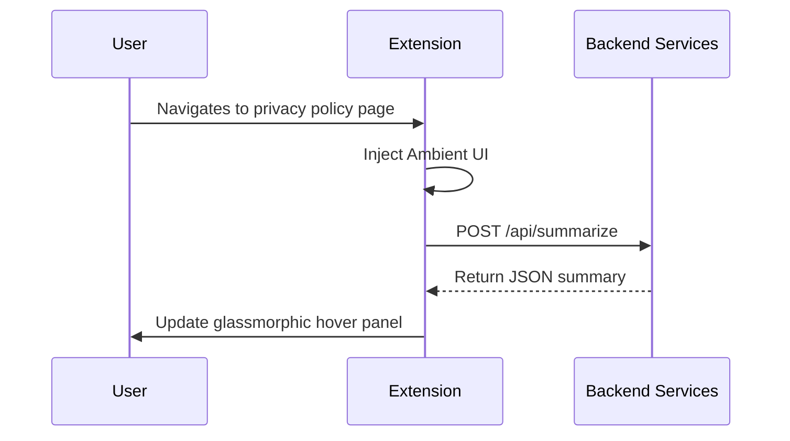
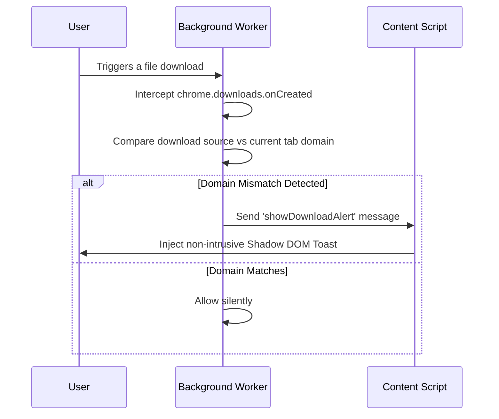

# Aura: Ambient Security & Privacy Layer

*A subtle, non-intrusive browser extension designed to protect users without interrupting their workflow.*

[Chrome Manifest V3] | [Next.js 16] | [Gemini 2.5 Flash Lite]

---

## Overview

Aura operates as an ambient security layer within your browser. It monitors your browsing environment in real-time and provides subtle visual cues to educate and protect against emerging threats, privacy risks, and misinformation.

### Core Features

* **Zero-Day Inference Engine**: Evaluates website metadata, TLS certificate integrity, and content context using Google Gemini to detect novel phishing or malicious sites before they appear on standard blacklists.
* **Threat Intelligence Sync**: Automatically cross-references visited domains against established threat databases to block known malicious sources.
* **Certificate & Security Audit**: Inspects TLS certificates for expiry, SNI mismatches, and audits HTTP security headers (HSTS, CSP, X-Frame-Options) to ensure connection integrity.
* **Privacy Sense**: Detects privacy policies and terms of service pages, generating a concise, plain-English summary of critical data retention and selling practices.
* **Trust Shield**: Scans social media feeds to detect urgency bias, tone mismatches, and metadata inconsistencies that indicate potential misinformation.
* **Download Audit**: Monitors active downloads and cross-references their origin domains against the user's current browsing flow. Emits subtle ambient toasts if a cross-domain or injected download is detected.
* **Ambient UI**: Utilizes the Shadow DOM to inject subtle visual indicators (such as pulsing icons, glassmorphic panels, and non-intrusive toasts) that alert users without disrupting their flow.

---

## Architecture Diagram

<details open>
<summary>View system diagram</summary>



</details>

---

## System Workflows

### 1. Active Threat Detection



### 2. Privacy Sense



### 3. Non-Blocking Download Audit



---

## Project Structure

```
AURA/
├── extension/                  
│   ├── manifest.json           
│   ├── background.js           
│   ├── content.js              
│   ├── popup.html              
│   ├── popup.js                
│   ├── styles.css              
│   └── icons/                  
│
└── api/                        
    ├── src/app/api/
    │   ├── summarize/route.ts  
    │   ├── trust-shield/route.ts 
    │   ├── threat-list/route.ts
    │   ├── cert-check/route.ts
    │   └── judge-site/route.ts
    ├── next.config.ts          
    └── .env                    
```

---

## Setup Instructions

### Prerequisites
* Node.js 18 or higher
* Google Chrome
* Gemini API Key

### 1. Start the Backend Service

```bash
cd api
echo "GEMINI_API_KEY=your_api_key_here" > .env
npm install
npm run dev
```
*The backend will initialize at http://localhost:3000.*

### 2. Load the Extension

1. Open `chrome://extensions` in Google Chrome.
2. Enable **Developer mode** in the top right corner.
3. Click **Load unpacked**.
4. Select the `extension` directory from this repository.

### 3. Verification

* **Threat Detection**: Navigate to an unknown site. The extension popup will display the current TLS status and the AI's zero-day inference result.
* **Privacy Sense**: Navigate to any major privacy policy page (e.g., Google or Meta). A subtle icon will appear in the bottom right; hover over it to view the generated summary.

---

Built for InnovateX 1.0 (Cybersecurity & Privacy).
